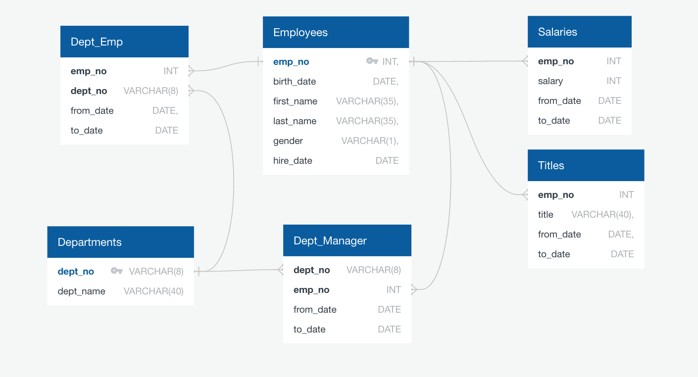
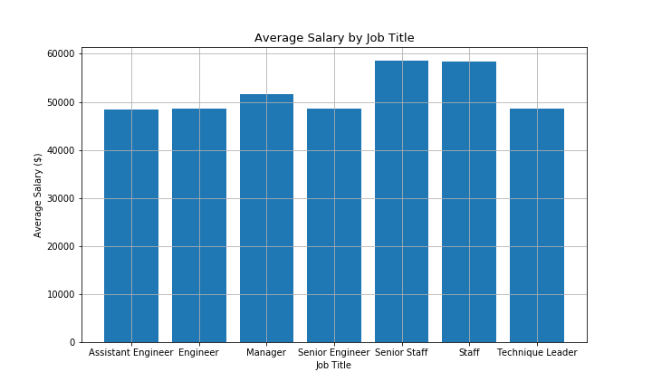

# SQL - Employee Database:

## Background

It is a beautiful spring day, and it is two weeks since you have been hired as a new data engineer at Pewlett Hackard. Your first major task is a research project on employees of the corporation from the 1980s and 1990s. All that remain of the database of employees from that period are six CSV files.

This script first designs the tables to hold data in the CSVs, then imports the CSVs into a SQL database, and answers questions about the data. In other words, it performs:

1. Data Modeling

2. Data Engineering

3. Data Analysis

#### Data Modeling

Inspects the CSVs and sketch out an ERD of the tables.

The ERD:

#### Data Engineering

* Uses the information given to create a table schema for each of the six CSV files. Specify data types, primary keys, foreign keys, and other constraints.

* Imports each CSV file into the corresponding SQL table.

#### Data Analysis

After completing the database, I do the following:

1. List the following details of each employee: employee number, last name, first name, gender, and salary.

2. List employees who were hired in 1986.

3. List the manager of each department with the following information: department number, department name, the manager's employee number, last name, first name, and start and end employment dates.

4. List the department of each employee with the following information: employee number, last name, first name, and department name.

5. List all employees whose first name is "Hercules" and last names begin with "B."

6. List all employees in the Sales department, including their employee number, last name, first name, and department name.

7. List all employees in the Sales and Development departments, including their employee number, last name, first name, and department name.

8. In descending order, list the frequency count of employee last names, i.e., how many employees share each last name.

## Additional Tasks

As you examine the data, you are overcome with a creeping suspicion that the dataset is fake. You surmise that your boss handed you spurious data in order to test the data engineering skills of a new employee. To confirm your hunch, you decide to take the following steps to generate a visualization of the data, with which you will confront your boss:

1. Import the SQL database into Pandas. (Yes, you could read the CSVs directly in Pandas, but you are, after all, trying to prove your technical mettle.) 

2. Create a bar chart of average salary by title.

3. Include a technical report in markdown format, outlining the data engineering steps taken in this assignment.

## Epilogue

Evidence in hand, you march into your boss's office and present the visualization. With a sly grin, your boss thanks you for your work. On your way out of the office, you hear the words, "Search your ID number." You look down at your badge to see that your employee ID number is 499942.

